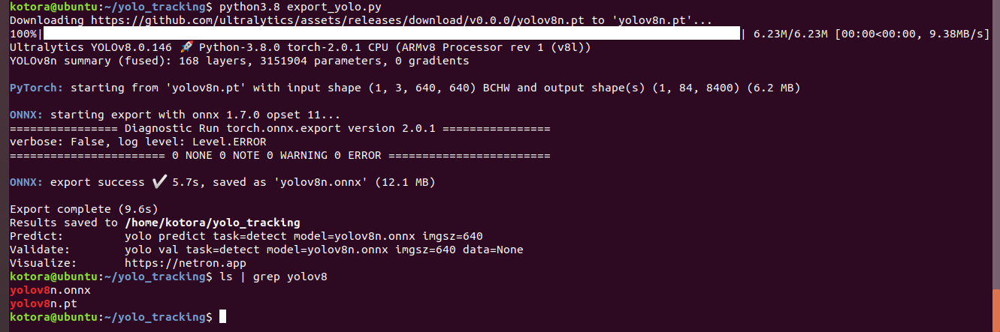

# System requirements

Có 2 option:
1. Jetson NX, Jetson Nano (đã test):
    - Jetpack 4.6.2
    - Ubuntu 18.04
    - Python3.8

2. Jetson NX, Jetson Orin (test sau khi có hàng):
    - Jetpack 5.1.1
    - Ubuntu 20.04
    - Python3.8

# Yolo configuration

1. For jetpack 4.6.2:


- Cài đặt gói apt:
```sh
sudo apt-get install protobuf-compiler libprotoc-dev
```

- Cài đặt onnx:
```sh
python3.8 -m pip install onnx==1.7.0
```

- Cài đặt onnxruntime-gpu:
```sh
wget https://nvidia.box.com/shared/static/8xgbee5ghhb92i9rrcr04yymg0n3x3t0.whl -O onnxruntime_gpu-1.7.0-cp38-cp38-linux_aarch64.whl
```
```sh
python3.8 -m pip install onnxruntime_gpu-1.7.0-cp38-cp38-linux_aarch64.whl
```

- Cài đặt yolo_tracking:
```sh
git clone https://github.com/hoangph3/yolo_tracking
cd yolo_tracking
python3.8 -m pip install -v -e .
```

- Cài đặt ultralytics:
```sh
python3.8 -m pip install git+https://github.com/hoangph3/ultralytics.git
```

- Export yolov8 onnx:
```
python3.8 export_yolo.py
```
Nếu lỗi báo thiếu module nào thì chạy: `python3.8 -m pip install <module_name>==<version>`, thông tin version của từng module xem trong file `requirements.txt`.



- Export reid onnx:
```
python3.8 export_reid.py
```


- Test tracking:
```sh
python3.8 examples/track.py --reid-model osnet_x0_25_msmt17.onnx --source "../warm_up_data/14b_0_105102/img1/*.jpg" --save-mot --classes 0 --yolo-model yolov8n.onnx
```
Trong đó `--source` là folder chứa các frame hoặc video.


Ở đây do onnxruntime version 1.7 không support GPU computation trên một số layer của mạng nên sẽ tự động fallback về CPU để tính.

Kết quả:


Tài nguyên:


2. For jetpack 5.1.1:

`<In progress>`